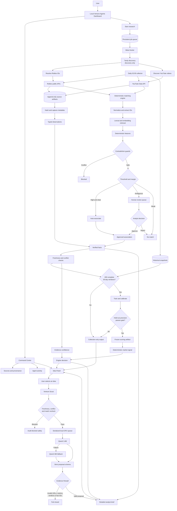
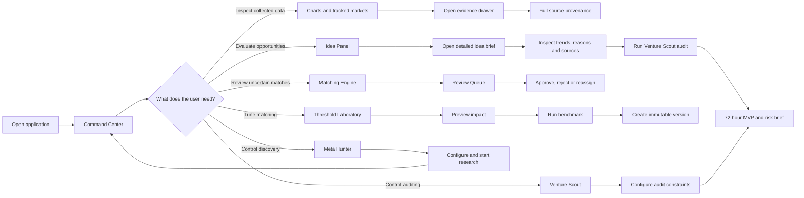

# Working prototype flowchart

```mermaid
flowchart TD
    U[User] --> UI[Local Venture Agents Dashboard]

    UI --> HOME[Command Center]
    HOME --> SRC[Sources and provenance]
    HOME --> ACT[Agent activity]
    HOME --> IDEAS[Idea Panel]

    UI --> START[Start research]
    START --> JOBS[(Persistent job queue)]
    JOBS --> MH[Meta Hunter]

    MH --> TAV[Tavily discovery<br/>discovery only]
    TAV --> RID[Resolve Roblox IDs]
    TAV --> YTS[Discover YouTube videos]

    RID --> RAPI[Roblox public APIs]
    YTS --> YAPI[YouTube Data API]

    RAPI --> RAW[(Append-only source artifacts)]
    YAPI --> RAW
    RAW --> HASH[Hash and capture metadata]
    HASH --> OBS[Typed observations]

    RAPI --> MATCH[Deterministic matching engine]
    YAPI --> MATCH

    MATCH --> NORM[Normalize and extract IDs]
    NORM --> RET[Lexical and embedding retrieval]
    RET --> FEAT[Deterministic features]
    FEAT --> GUARD{Contradiction guards}

    GUARD -->|Conflict| BLOCK[Blocked]
    GUARD -->|Safe| DECIDE{Threshold and margin}

    DECIDE -->|High and clear| AUTO[Auto-associate]
    DECIDE -->|Ambiguous| REVIEW[Human review queue]
    DECIDE -->|Weak| NOMATCH[No match]

    REVIEW --> HUMAN{Analyst decision}
    HUMAN -->|Approve| APPROVED[Approved association]
    HUMAN -->|Reject| NOMATCH
    AUTO --> APPROVED

    APPROVED --> FACTS[Verified facts]
    OBS --> FACTS
    FACTS --> CONFLICTS[Freshness and conflict checks]

    DAILY[Daily 02:00 collector] --> RAPI
    DAILY --> YAPI
    DAILY --> HISTORY[(Historical snapshots)]

    HISTORY --> READY{200 complete<br/>30-day windows?}
    CONFLICTS --> READY

    READY -->|No| COLLECTION[Collection-only output]
    READY -->|Yes| TRAIN[Train and calibrate]
    TRAIN --> BENCH{Held-out precision<br/>passes gate?}
    BENCH -->|No| COLLECTION
    BENCH -->|Yes| FROZEN[Frozen scoring artifact]

    FROZEN --> SCORE[Deterministic market signal]
    CONFLICTS --> CONF[Evidence confidence]
    SCORE --> VERDICT[Engine decision]
    CONF --> VERDICT

    COLLECTION --> IDEAS
    VERDICT --> IDEAS

    IDEAS --> SELECT[User selects an idea]
    SELECT --> VS[Venture Scout]
    VS --> RECHECK{Freshness, conflict<br/>and match recheck}
    RECHECK -->|Blocked| STOP[Audit blocked safely]
    RECHECK -->|Pass| GPU[Serialized local GPU queue]

    GPU --> Q14[Qwen3 14B]
    Q14 -->|Failure| Q8[Qwen3 8B fallback]
    Q14 --> SCHEMA[Strict proposal schema]
    Q8 --> SCHEMA

    SCHEMA --> FIREWALL{Evidence firewall}
    FIREWALL -->|Invalid URLs, metrics,<br/>verdicts or fact IDs| FAIL[Fail closed]
    FIREWALL -->|Valid proposal| BRIEF[Detailed analyst brief]

    FACTS --> BRIEF
    VERDICT --> BRIEF
    BRIEF --> IDEAS
```

# User journey flowchart

```mermaid
flowchart LR
    A[Open application] --> B[Command Center]
    B --> C{What does the user need?}

    C -->|Inspect collected data| D[Charts and tracked markets]
    D --> E[Open evidence drawer]
    E --> F[Full source provenance]

    C -->|Evaluate opportunities| G[Idea Panel]
    G --> H[Open detailed idea brief]
    H --> I[Inspect trends, reasons and sources]
    I --> J[Run Venture Scout audit]
    J --> K[72-hour MVP and risk brief]

    C -->|Review uncertain matches| L[Matching Engine]
    L --> M[Review Queue]
    M --> N[Approve, reject or reassign]

    C -->|Tune matching| O[Threshold Laboratory]
    O --> P[Preview impact]
    P --> Q[Run benchmark]
    Q --> R[Create immutable version]

    C -->|Control discovery| S[Meta Hunter]
    S --> T[Configure and start research]
    T --> B

    C -->|Control auditing| U[Venture Scout]
    U --> V[Configure audit constraints]
    V --> K
```
